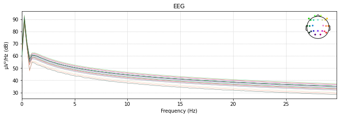
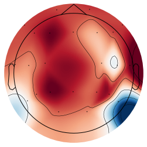

### MNE Python EEG Analysis Tutorial


```python
# imports 
import mne
import pandas as pd
import matplotlib.pyplot as plt
import numpy as np
%matplotlib inline
```


```python
# to be able to use the graphical user interface apply this magic
%matplotlib notebook
```


```python
%gui qt
```

Impedance example
<div>

</div>

### Load Data


```python
fdir = 'Experiment/output_data/'
fname = 'sub-1_ses-sleepy.fif'
raw = mne.io.read_raw_fif(fdir+fname)

# Details über die Elektroden und den Aplifier

```

    Opening raw data file Experiment/output_data/sub-1_ses-sleepy.fif...
    Isotrak not found
        Range : 0 ... 14868 =      0.000 ...    29.736 secs
    Ready.
    

    C:\Users\gross\AppData\Local\Temp\ipykernel_18644\2976534055.py:3: RuntimeWarning: This filename (Experiment/output_data/sub-1_ses-sleepy.fif) does not conform to MNE naming conventions. All raw files should end with raw.fif, raw_sss.fif, raw_tsss.fif, _meg.fif, _eeg.fif, _ieeg.fif, raw.fif.gz, raw_sss.fif.gz, raw_tsss.fif.gz, _meg.fif.gz, _eeg.fif.gz or _ieeg.fif.gz
      raw = mne.io.read_raw_fif(fdir+fname)
    


```python
#raw.plot(scalings=1e-1)
raw.plot_psd(0,30)
#raw.plot(duration=3, n_channels=5, scalings=1e-1)
plt.show()
```

    Effective window size : 4.096 (s)
    


    

    


```python
# check if standard montag is set
if raw.info['dig'] is not None:
    print("Montage is set.")
else:
    print("Montage is not set.")
```

    Montage is set.
    


```python
# it is not so I use the standard one:
montage = mne.channels.make_standard_montage('standard_1020')
raw.info.set_montage(montage)
```


<table class="table table-hover table-striped table-sm table-responsive small">
    <tr>
        <th>Measurement date</th>

        <td>Unknown</td>

    </tr>
    <tr>
        <th>Experimenter</th>

        <td>Unknown</td>

    </tr>
        <th>Participant</th>

        <td>Unknown</td>

    </tr>
    <tr>
        <th>Digitized points</th>

        <td>0 points</td>

    </tr>
    <tr>
        <th>Good channels</th>
        <td>24 EEG</td>
    </tr>
    <tr>
        <th>Bad channels</th>
        <td>None</td>
    </tr>
    <tr>
        <th>EOG channels</th>
        <td>Not available</td>
    </tr>
    <tr>
        <th>ECG channels</th>
        <td>Not available</td>

    <tr>
        <th>Sampling frequency</th>
        <td>500.00 Hz</td>
    </tr>


    <tr>
        <th>Highpass</th>
        <td>0.00 Hz</td>
    </tr>


    <tr>
        <th>Lowpass</th>
        <td>250.00 Hz</td>
    </tr>


</table>


```python
# Plot topomap for a specific time point (e.g., 100 ms)
time_point = 0.1  # In seconds
average = np.mean(raw.get_data(),1)
print(average.shape)
mne.viz.plot_topomap(average, raw.info)
```

    (24,)
    


    

    


    (<matplotlib.image.AxesImage at 0x1733dcb5820>,
     <matplotlib.contour.QuadContourSet at 0x1733dcb5ac0>)


## Load Data (example data)


```python
sample_data_folder = mne.datasets.sample.data_path()
```

## Preprocessing


```python
# filtering 

# ICA component analysis 

```

## Analysis
Das Ziel ist es den Energieverbrauch der beiden Datensätze zu vergleichen. 

